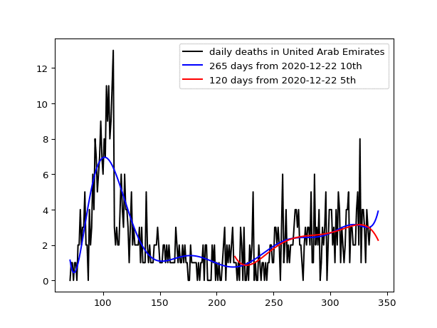

# UAE
<pre>
A paper is entitled "Artificial Intelligence (AI) suggests that UAE needs to mitigate 
the small COVID-19 resurgence" published in Dubai Medical Journal in April 2021:
</pre>
<a href="https://doi.org/10.1159/000514590"> Dubai Medical Journal</a>

https://doi.org/10.1159/000514590
<pre>
0. Python libraries installation is needed to run animedaily.py
   animedaily.py is a program to generate png files for entered Country.
In order to install the necessary libraries, see https://github.com/ytakefuji/python-novice
1. Download new_deaths.csv file.
2. python animedaily.py
   United Arab Emirates
3. convert -delay 10 -loop 5 *.png uae.gif
   convert is a command to convert png files into a gif file
In order to use a convert command, install ImageMagick for your OS.
</pre>

The new_deaths.csv is downloaded from the following site: 

https://raw.githubusercontent.com/owid/covid-19-data/master/public/data/jhu/new_deaths.csv

the number of predicted daily deaths due to the covid-19 in UAE as of March 16 2021.
In the graph, black line: the number of daily deaths, blue line: predicted curve using 350 days based on 10th degree polynomial curve-fitting, red line changing the number of days　from 100 to 350 days from March 16 2021 based on 5th degree polynomial curve-fitting.

